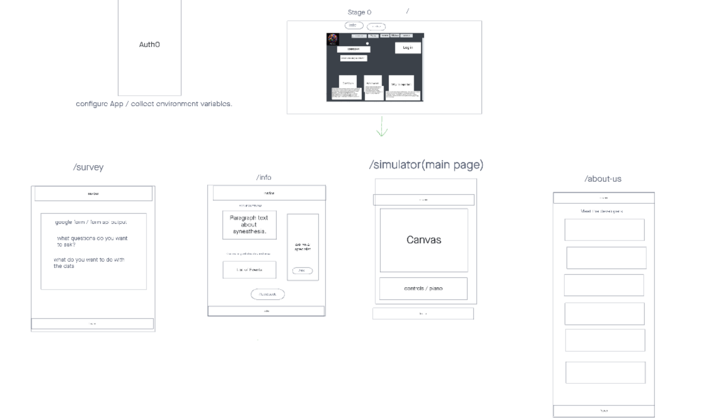

# Project Name

**Author**: Kawika Reveira, Justin Cheeseman, Ahmed Elnogoumi, Mak Trnka, Brock Britton, John Gause
**Version**: 1.0.2

## Overview
<!-- Provide a high level overview of what this application is and why you are building it, beyond the fact that it's an assignment for this class. (i.e. What's your problem domain?) -->

## Getting Started
<!-- What are the steps that a user must take in order to build this app on their own machine and get it running? -->

## Architecture
<!-- Provide a detailed description of the application design. What technologies (languages, libraries, etc) you're using, and any other relevant design information. -->

## Change Log #

03-18-2024 11:07pm Updated README.md to add Documentation Template, Added Time estimates template.
03-18-2024 2:00pm Added Header and Footer to App.jsx.
03-19-2024 11:18am Added canvas and piano buttons to Simulator Page.
03-19-2024 2:00pm Added color to letters feature with toggle button on Info page.
03-19-2024 5:00pm Fixed ghosting of fireworks on the canvas.
03-20-2024 2:00pm Added content and styling to info page.

## Credit and Collaborations
<!-- Give credit (and a link) to other people or resources that helped you build this application. -->

# Time Estimates #

Name of feature: Header and Footer

Estimate of time needed to complete: 25 minutes

Start time: 10:00

Finish time: 10:30

Actual time needed to complete: 30 minutes

*************************************************************************************************************************

Name of feature: Simulator Page - canvas and piano

Estimate of time needed to complete: 1.5 hours

Start time: 10:30

Finish time: 2:30

Actual time needed to complete: 3 hours (1 hour lunch break)

*************************************************************************************************************************

Name of feature: Color to Letters

Estimate of time needed to complete: 30 minutes

Start time: 1:15pm

Finish time: 2:00pm

Actual time needed to complete: 45 minutes

*************************************************************************************************************************

Name of feature: Info page content, styling and layout

Estimate of time needed to complete: 3hrs

Start time: N/A

Finish time: N/A

Actual time needed to complete: N/A

*************************************************************************************************************************

Name of feature: Home Page Styling

Estimate of time needed to complete: 2 hours

Start time: 10:00am

Finish time: 2:00pm

Actual time needed to complete: 3 hours

*************************************************************************************************************************

Name of feature: Info page content, styling and layout

Estimate of time needed to complete: ______

Start time: ________

Finish time: _______

Actual time needed to complete: _______

# Project Overview #

# User Stories #

# Wireframe #

